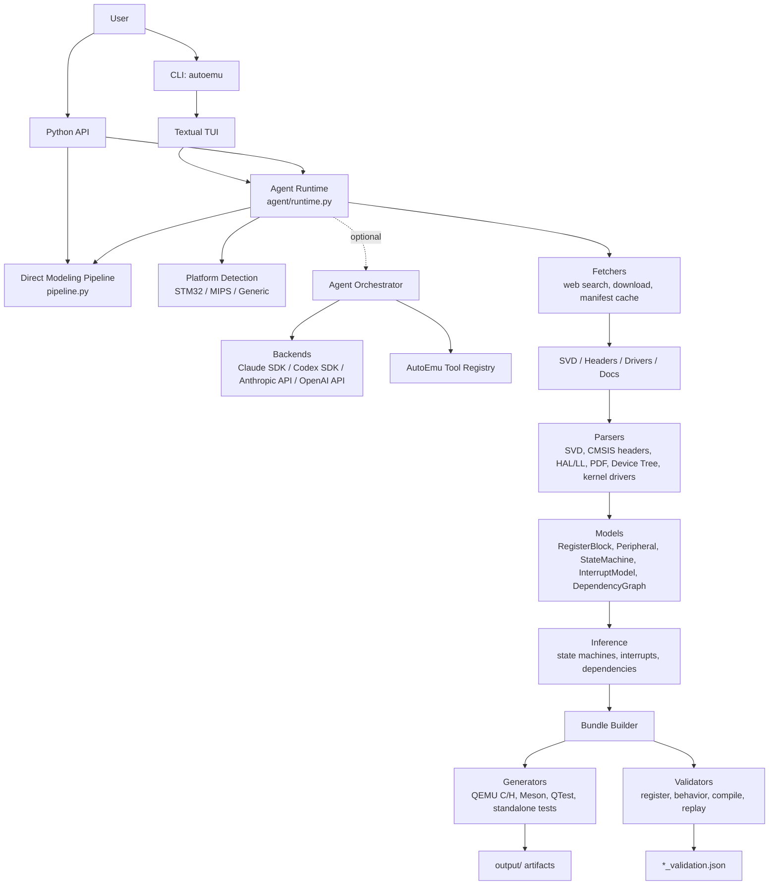

# AutoEmu

Harness-first QEMU peripheral model generation for microcontrollers and SoC
targets.

AutoEmu takes a target MCU or board name plus a peripheral identifier, gathers
or accepts hardware inputs, builds a structured peripheral model, emits
latest-upstream-QEMU-compatible artifacts, and validates the generated bundle.

The deterministic harness path is the primary implementation. Agent backends
are optional helpers for fetch/build enrichment; they do not replace the local
parsers, inference passes, generators, or validators.

## Architecture



## Workflow

The public `AutoEmuAgentRuntime.run_pipeline()` workflow has four high-level
phases:

1. **Detect platform** — infers vendor, architecture, family, and platform
   plugin from the target name.
2. **Fetch input data** — discovers and downloads candidate SVD, header,
   driver, and documentation files into `data/<target>/`, with manifest-based
   input resolution.
3. **Build QEMU peripheral model** — runs the deterministic modeling pipeline:
   register extraction, driver analysis, state/interrupt/dependency inference,
   peripheral assembly, and artifact generation.
4. **Validate generated code** — checks generated C/H files against QEMU
   include paths when available, reports warnings for missing QEMU headers, and
   flags non-functional empty models.

The lower-level `run_model_pipeline()` accepts explicit input files and runs
the modeling sub-pipeline directly:


## Supported Platforms

| Platform | Register sources | Driver sources | Notes |
|----------|------------------|----------------|-------|
| STM32 | CMSIS-SVD, CMSIS headers | STM32 HAL / LL C drivers | Dedicated platform plugin and naming |
| MIPS | PDF register tables, Device Tree, vendor headers | Linux kernel drivers using `readl` / `writel` | Dedicated MIPS parsers |
| Generic | SVD, XML, C headers, datasheets | Generic C drivers, Linux sources | Fallback for HiSilicon, Qualcomm, ESP32, Nordic, RISC-V, NXP, TI, and unknown targets |

## Installation

```bash
pip install -e .
```

For development:

```bash
pip install -e ".[dev]"
```

For standalone packaging:

```bash
pip install -e ".[build]"
pyinstaller autoemu.spec --clean
```

Compilation validation uses `cc`, `gcc`, or `clang` when present. Full QEMU
header validation is enabled when AutoEmu can resolve a QEMU source tree. Set
`AUTOEMU_QEMU_SRC=/path/to/qemu` for an existing checkout, or
`AUTOEMU_QEMU_SRC=latest` to clone/update the upstream QEMU master branch in
AutoEmu's managed cache.

## Build Environment

Three shell scripts manage a self-contained build environment for compiling QEMU,
Linux, and Buildroot from upstream source and running a minimal VM.

| Script | Purpose |
|--------|---------|
| `setup-env.sh` | Download and extract Linux 6.12.28, QEMU 9.2.0, and Buildroot 2024.02.10 into `env/src/` |
| `build-env.sh` | Compile QEMU, Linux, and Buildroot out-of-tree with stamp-file resumability |
| `run.sh` | Launch a minimal VM using the compiled artifacts |

**Supported architectures:** `x86_64`, `aarch64` (default), `riscv64`, `mipsel`

**Quick start:**

```bash
./setup-env.sh                    # fetch sources
./build-env.sh                    # compile for aarch64
./run.sh                          # boot the VM
```

**Environment variables:**

| Variable | Default | Description |
|----------|---------|-------------|
| `ARCH` | `aarch64` | Target architecture |
| `JOBS` | `$(nproc)` | Parallel build jobs |
| `CLEAN` | `0` | Force rebuild by removing stamps |
| `MEMORY` | `512M` | VM RAM |
| `EXTRA_QEMU_OPTS` | `""` | Additional QEMU arguments |

Cross-compilers are required for non-native architectures:
- `aarch64`: `aarch64-linux-gnu-gcc`
- `riscv64`: `riscv64-linux-gnu-gcc`
- `mipsel`: `mipsel-linux-gnu-gcc`

Per-architecture kernel config fragments live in `configs/linux-*.fragment` to
ensure virtio/IDE, EXT4, and serial console drivers are enabled for QEMU boot.
Builds are fully non-interactive (`TERM=dumb`, stdin redirected from `/dev/null`).

## Usage

### Interactive TUI

```bash
autoemu
```

The TUI collects target MCU/board and peripheral names, runs the unified
pipeline, streams progress by phase, and writes a timestamped log after each
run.

### Runtime API

Use this path when AutoEmu should detect the platform, fetch inputs, build, and
validate from only target names:

```python
from autoemu.agent.runtime import AutoEmuAgentRuntime

runtime = AutoEmuAgentRuntime()
result = runtime.run_pipeline(
    target_mcu="STM32F407VG",
    target_peripheral="ETH",
)
```

### Direct Modeling API

Use this path when input files are already available:

```python
from autoemu.pipeline import run_model_pipeline

result = run_model_pipeline(
    peripheral_name="USART1",
    output_dir="output",
    svd_path="path/to/device.svd",
    header_path="path/to/stm32f4xx.h",
    driver_paths=["path/to/stm32f4xx_hal_uart.c"],
    documentation_paths=["path/to/reference_manual.txt"],
    mcu_family="STM32F4",
)
```

To reuse already fetched data under `data/<target>/`:

```python
from autoemu.pipeline import run_target_model_pipeline

result = run_target_model_pipeline(
    target_mcu="STM32F407VG",
    target_peripheral="ETH",
    data_dir="data/stm32f407vg",
    output_dir="output",
)
```

## Configuration

Create `.autoemu.toml` in the working directory:

```toml
[agent]
backend = "harness"           # "harness", "claude-sdk", "codex-sdk", "anthropic-api", or "openai-api"
model = ""                    # Optional backend-specific model override
max_budget_usd = 5.0

anthropic_api_key = ""
anthropic_base_url = ""

openai_api_key = ""
openai_base_url = ""

[validation]
qemu_src = ""                  # Existing QEMU checkout, or "latest"
```

Environment variables override the config file:

| Variable | Purpose |
|----------|---------|
| `AUTOEMU_AGENT_BACKEND` | `harness`, `claude-sdk`, `codex-sdk`, `anthropic-api`, or `openai-api` |
| `AUTOEMU_AGENT_MODEL` | Optional model override |
| `AUTOEMU_AGENT_MAX_BUDGET_USD` | Optional per-run budget limit for agent backends |
| `ANTHROPIC_API_KEY` | Anthropic / Claude-compatible API key |
| `ANTHROPIC_BASE_URL` | Anthropic / Claude-compatible endpoint |
| `OPENAI_API_KEY` | OpenAI-compatible API key |
| `OPENAI_BASE_URL` | OpenAI-compatible endpoint |
| `AUTOEMU_QEMU_SRC` | Existing QEMU source checkout, or `latest` for upstream master in AutoEmu's cache |

Backend modes:

| Backend | Behavior |
|---------|----------|
| `harness` | Local deterministic pipeline only |
| `claude-sdk` | Claude Agent SDK runtime |
| `codex-sdk` | Codex app-server SDK runtime |
| `anthropic-api` | Anthropic-compatible Messages API with AutoEmu tools |
| `openai-api` | OpenAI-compatible Chat Completions API with AutoEmu tools |

See `.autoemu.toml.example` for a commented template.

## Output

A successful model build writes intermediate JSON, generated QEMU artifacts,
standalone tests, and validation output. For `target_mcu="STM32F407VG"` and
`target_peripheral="ETH"`, typical files are:

```text
output/
├── eth_registers.json
├── eth_state_machine.json
├── eth_interrupt_model.json
├── eth_dependencies.json
├── eth_peripheral.json
├── stm32f4_eth.h
├── stm32f4_eth.c
├── meson.build
├── qtest_stm32f4_eth.c
├── stm32f4_eth_model.json
├── test_stm32f4_eth.c
└── eth_validation.json
```

Fuzz harness generation is available through
`autoemu.generators.fuzz_generator.generate_fuzz_harness()` and produces
`fuzz_<peripheral>_regs.c` and `fuzz_<peripheral>_states.c`.

## Project Structure

```text
src/autoemu/
├── main.py                      # Click entry point that launches the TUI
├── pipeline.py                  # Direct modeling pipeline
├── modeling_utils.py            # Shared normalization/loading helpers
├── models/                      # Pydantic v2 data models
├── parsers/                     # SVD, header, driver, and register extraction
├── fetchers/                    # Web discovery, download, cache, input resolution
├── inference/                   # State machine, interrupt, dependency inference
├── generators/                  # QEMU, Meson, QTest, standalone, fuzz generators
├── validators/                  # Register, behavior, compile, replay, security helpers
├── platforms/                   # STM32, MIPS, and generic platform plugins
├── agent/                       # Runtime, orchestrator, tool registry, backends
└── tui/                         # Textual UI and widgets
```

## Running Tests and Checks

```bash
pytest
pytest -m integration
ruff check src tests
pyflakes src tests
mypy src tests
python -m compileall -q src tests
```

The default test suite is local and deterministic. Integration tests exercise
end-to-end behavior and may require network access or local fetched inputs.

## Dependencies

| Package | Role |
|---------|------|
| `textual` | Terminal UI |
| `click` | CLI |
| `pydantic >= 2` | Data models |
| `lxml` | SVD / HTML parsing |
| `jinja2` | Code-generation support |
| `rich` | Terminal formatting |
| `pyyaml` | Configuration/data parsing |
| `anthropic` | Anthropic-compatible API backend |
| `claude-agent-sdk` | Claude SDK backend |
| `codex-app-server-sdk` | Codex SDK backend |
| `openai` | OpenAI-compatible API backend |
